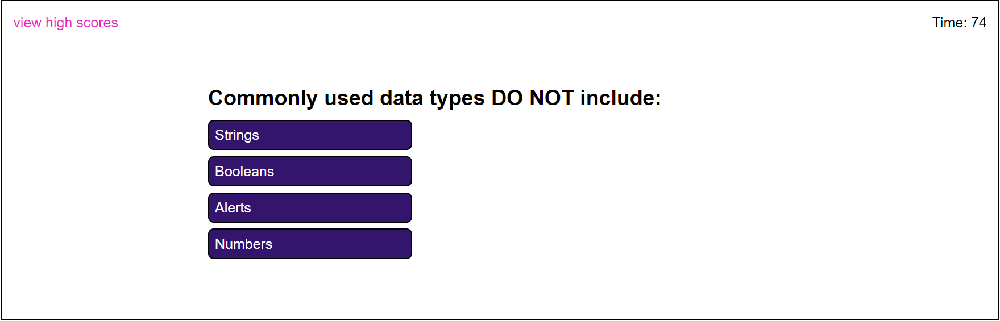

# Code-Quiz

## Description 📝
This website is built to create a timed coding quiz with multiple-choice questions. You will have 75 seconds to finish 5 questions. When you answer  aquestion incorrectly, 10 seconds will be subtracted from the time bank.
After you finish five questions or your time is up, you can enter your initial and save your score. You can view or delete your score records.

## Website

https://vantam8300.github.io/code-quiz/